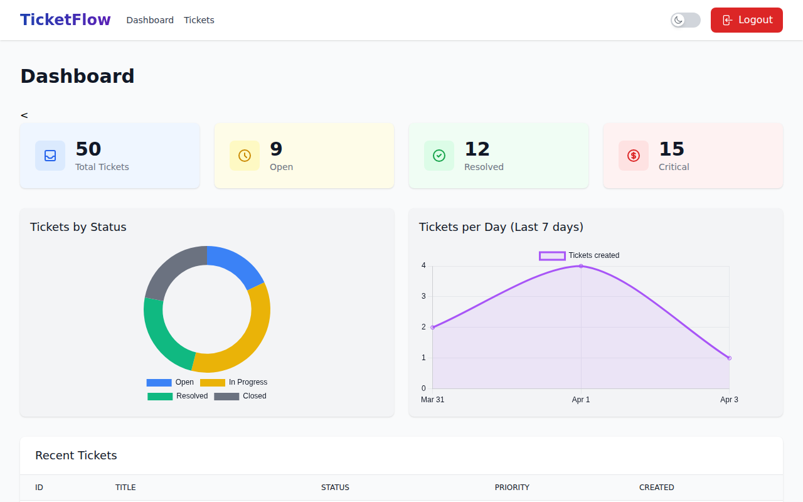
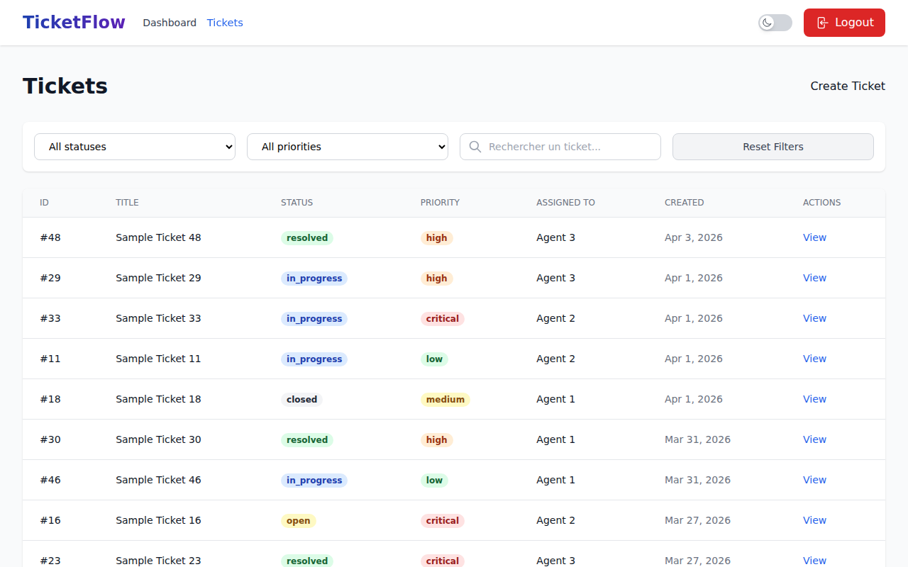
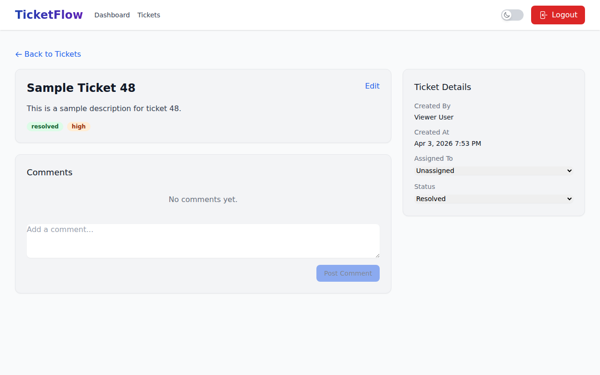

# TicketFlow - Système de Gestion de Tickets de Support

TicketFlow est une application moderne de gestion de tickets de support construite avec Laravel 13, Vue 3 et Tailwind CSS. Elle offre une interface intuitive pour suivre, gérer et résoudre les demandes d'assistance.

## 🚀 Aperçu

### 🔐 Connexion


### 📊 Tableau de Bord


### 🎫 Liste des Tickets


### 📝 Détail d'un Ticket


## ✨ Fonctionnalités Clés

- **Gestion de Tickets** : Création, mise à jour et suivi du cycle de vie des tickets.
- **Tableau de Bord Analytique** : Visualisation en temps réel des statistiques via Chart.js (Tickets par statut, volume quotidien).
- **Système de Rôles** : Support multi-utilisateurs (Admin, Agent, Viewer).
- **Commentaires en Direct** : Collaboration simplifiée sur chaque ticket.
- **Design Adaptatif** : Interface soignée avec Tailwind CSS, supportant le mode sombre.
- **Authentification Sécurisée** : Gestion via Laravel Sanctum.

## 🛠️ Stack Technique

- **Backend** : Laravel 13 (PHP 8.3+)
- **Frontend** : Vue 3 (Composition API), Vite, Tailwind CSS
- **Base de données** : SQLite (par défaut)
- **Graphiques** : Chart.js
- **Icônes** : Heroicons

## ⚙️ Installation

### Prérequis
- PHP 8.3+
- Composer
- Node.js & NPM

### Étapes d'installation

1. **Cloner le projet**
   ```bash
   git clone <repository-url>
   cd ticket-flow
   ```

2. **Installer les dépendances PHP**
   ```bash
   composer install
   ```

3. **Installer les dépendances JavaScript**
   ```bash
   npm install
   ```

4. **Configurer l'environnement**
   ```bash
   cp .env.example .env
   php artisan key:generate
   ```

5. **Initialiser la base de données**
   ```bash
   touch database/database.sqlite
   php artisan migrate --seed
   ```

6. **Compiler les assets**
   ```bash
   npm run build
   ```

7. **Lancer le serveur**
   ```bash
   php artisan serve
   ```
   L'application sera accessible sur `http://localhost:8000`.

## 🧪 Données de Test

Pour explorer l'application, vous pouvez utiliser le compte administrateur suivant :

- **Login** : `admin@demo.com`
- **Mot de passe** : `password`

D'autres comptes sont disponibles après le seeding (`agent1@demo.com`, `viewer@demo.com` avec le même mot de passe).

---
Développé avec ❤️ pour une gestion de support efficace.
